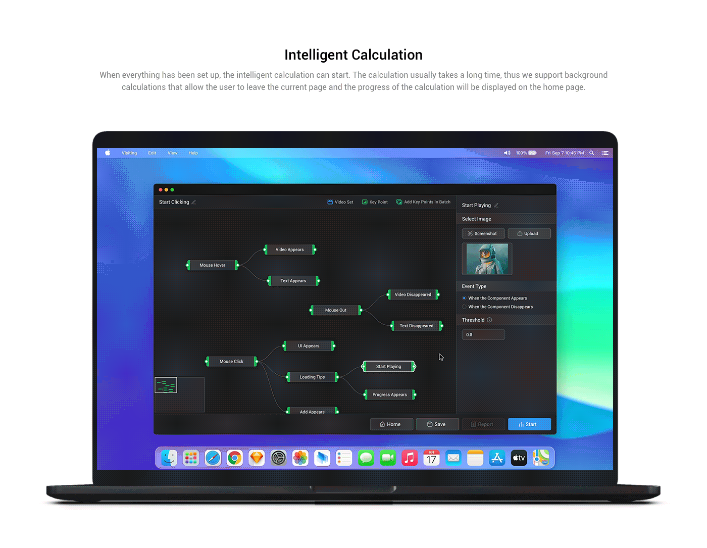
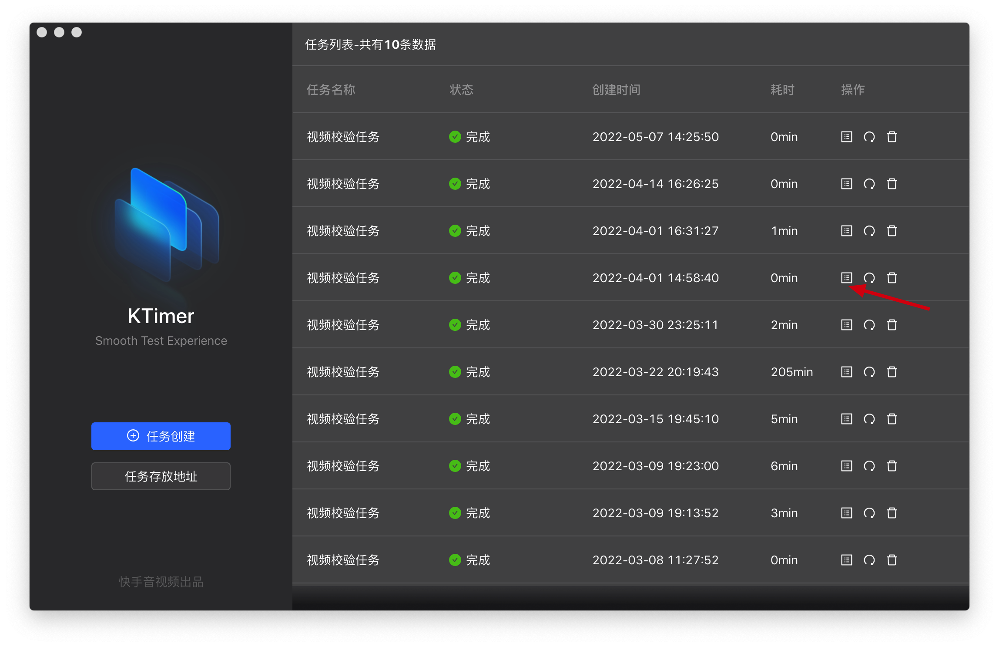

# KTimer使用指南

欢迎使用KTimer

KTimer是一款`智能可视化体感竞品耗时工具`

## 什么是体感耗时

很多QA同学经常要将某个场景录制下来，然后拆帧的形式去计算一个场景耗费的时间的测试。

这种用人眼的形式，感受某个场景的加载耗时形式，我定义为体感耗时测试。

使用方式非常简单

## 使用方式

### 上传视频

### 分析视频，设置关键点

### 截取相似点

### 执行测试

### 结果汇总

